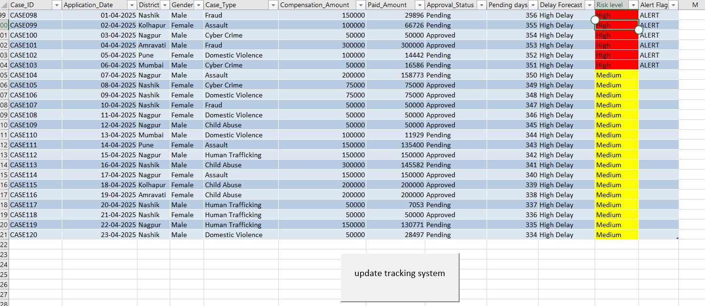
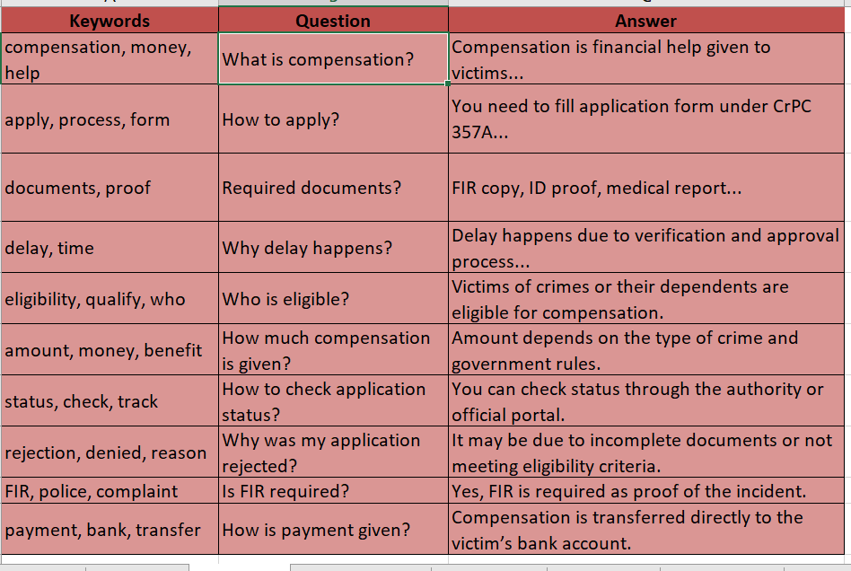
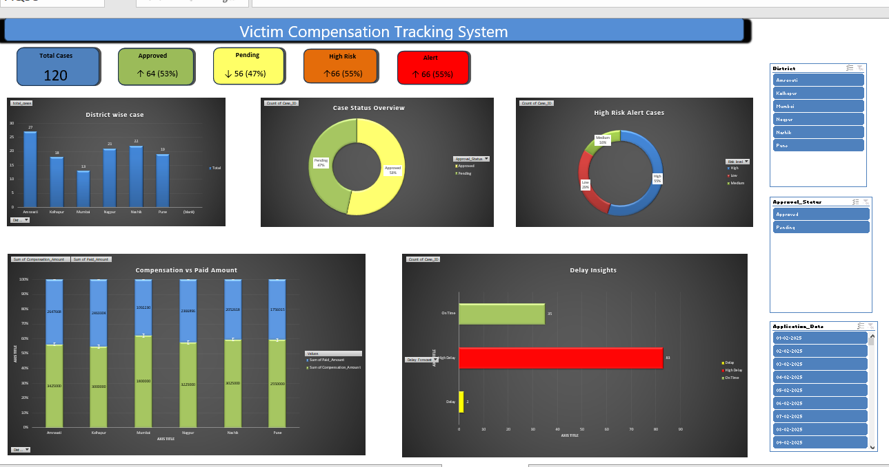

# 📊 Victim Compensation Tracking System

## 📌 Project Overview

The Victim Compensation Tracking System is an Excel-based, macro-enabled solution designed to efficiently manage and monitor victim compensation cases.

The system automatically:
- Reads case data
- Calculates delays at different stages (police, court, total)
- Classifies cases into Low, Medium, or High delay risk using VBA automation

With a single click, the system generates a structured **Tracking Dashboard**, helping to:
- Identify delayed cases
- Monitor case status
- Improve decision-making

This reduces manual effort, minimizes errors, and ensures faster and more transparent compensation processing.

## 🖼️ Project Screenshots

### 📁 Case Data

### ❓ FAQ Data

### 📊 Dashboard

### 🤖 Query System

### ⚙️ Project Structure
After extracting the project files, you will find:
- **📁 Project Folder**
  - **📁 images** → Contains all project screenshots
  - **📁 scripts** → Contains VBA/Python scripts (if any)
  - **📄 Excel File** → Main working file (.xlsm)
  
#### 📂 Excel File Structure
The Excel workbook contains 6 sheets:
1. **🟦 Sheet 1: Case_Data**
   - Contains 120 mock dataset records.
   - Includes a button to:
     - Calculate approval status,
     - Calculate delays,
     - Identify high-risk cases,
     - Calculate pending days.
2. **🟨 Sheet 2: Keywords (FAQ Data)**
   - Contains predefined keywords.
   - Used for answering user queries.
   - Helps the system identify relevant responses.
3. **🟩 Sheet 3: Query_System**
   - User enters questions here.
   - System displays corresponding answers.
   - Works like a basic AI query tool.
4. **🟧 Sheet 4: Pivot_Table**
   - Contains pivot tables used as backend data for dashboard creation.
5. **🟪 Sheet 5: Dashboard**
   - Provides a visual summary of the entire project.
   - Includes charts and key insights.	- Helps in analysis and decision-making.
6. **🟥 Sheet 6: Calculations**	-	Contains backend calculations supporting delay computation and logic.
the steps to run the project:
a) Download the ZIP file or clone the repository using `git clone <your-repo-link>`;
b) Extract the downloaded ZIP file;
c) Open the `.xlsm` (Macro-enabled Excel file);
d) Enable macros by clicking "Enable Content" when prompted;
e) Run the system by clicking the button available in Sheet 1 (Case_Data). The system will automatically calculate delays, classify risk levels, and update tracking data.
'th key features include:
a) Automated case tracking,
b) One-click delay calculation,
c) Risk classification (Low / Medium / High),
d) Basic AI-based query system,
e) Interactive dashboard using pivot tables,
f) Structured and user-friendly Excel system.